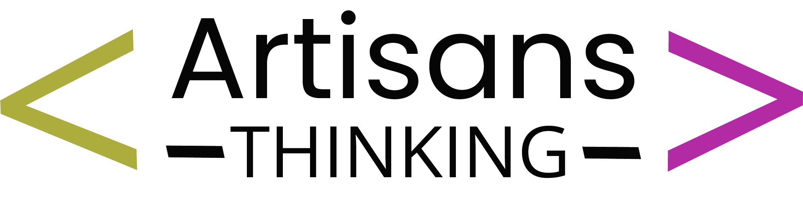

# 🛍️ Next - Sistema de Gestión de Tienda de Ropa

<div align="center">
  
  
  [](https://php.net/)
  [](https://mysql.com/)
  [](https://getbootstrap.com/)
  [](https://developer.mozilla.org/docs/Web/JavaScript)

  <h3>🏪 Sistema integral de gestión comercial para tiendas de ropa</h3>
  <p><strong>Desarrollado en Argentina 🇦🇷 | Chañar Ladeado, Santa Fe</strong></p>
</div>

---

## 📋 Descripción del Proyecto

**Next** es un sistema web completo diseñado específicamente para la gestión integral de tiendas de ropa pequeñas y medianas. Combina funcionalidades avanzadas de punto de venta, gestión de inventario, sistema de préstamos y análisis de datos en una interfaz moderna y fácil de usar.

### 🎯 Objetivo Principal

Optimizar la operación diaria de tiendas de ropa mediante la digitalización de procesos, proporcionando herramientas para el control de ventas, gestión de clientes, manejo de préstamos de prendas y análisis de rendimiento comercial.

---

## ✨ Características Principales

### 🏠 Dashboard Inteligente
- **📊 Estadísticas en Tiempo Real**: Métricas comparativas mensuales y análisis de tendencias
- **📈 Visualización de Datos**: Gráficos interactivos y tarjetas informativas
- **🔍 Rankings Dinámicos**: Productos más vendidos y mejores clientes históricos
- **📅 Información Contextual**: Fechas en español y datos actualizados automáticamente

### 💰 Módulo de Ventas
- **🛒 Punto de Venta Completo**: Registro rápido de transacciones
- **👥 Gestión de Clientes**: Base de datos integrada con historial de compras
- **📋 Listado Avanzado**: Tabla interactiva con filtros y búsqueda
- **💳 Control de Pagos**: Gestión de pagos parciales y seguimiento de deudas
- **📤 Exportación**: Reportes en Excel con datos personalizables

### 🤝 Sistema de Préstamos
- **👗 Gestión de Prendas**: Control de inventario para préstamos
- **📆 Seguimiento Temporal**: Fechas límite y notificaciones automáticas
- **💲 Control Financiero**: Gestión de montos y estados de pago
- **🔔 Alertas Inteligentes**: Notificaciones de vencimientos próximos

### 👤 Administración de Usuarios
- **🔐 Control de Acceso**: Sistema de autenticación seguro
- **⚙️ Gestión de Perfiles**: Creación y administración de usuarios
- **📧 Validación Avanzada**: Verificación de emails en tiempo real
- **🔄 Estados Dinámicos**: Activación/desactivación de cuentas

---

## 🛠️ Arquitectura Técnica

### 💻 Stack Tecnológico

#### Backend
- **PHP 8+**: Lenguaje principal con orientación a objetos
- **MySQL 8.0+**: Base de datos relacional optimizada
- **PDO**: Interfaz de acceso a datos segura

#### Frontend
- **HTML5 & CSS3**: Estructura y estilos modernos
- **Bootstrap 5.3**: Framework CSS responsivo
- **JavaScript ES6+**: Interactividad y funcionalidades dinámicas
- **DataTables**: Tablas avanzadas con funcionalidades integradas
- **SweetAlert2**: Notificaciones elegantes y modales

#### Librerías y Herramientas
- **Font Awesome 6**: Iconografía completa
- **PHPSpreadsheet**: Generación de reportes Excel
- **Chart.js**: Gráficos y visualizaciones (preparado para futuras expansiones)

### 🏗️ Arquitectura de Software

```
Next/
├── 🎨 Frontend (Responsive UI)
│   ├── Bootstrap 5 + CSS Custom
│   ├── JavaScript Modular
│   └── Componentes Reutilizables
│
├── ⚙️ Backend (PHP MVC Pattern)
│   ├── Controllers (Lógica de negocio)
│   ├── Models (Gestión de datos)
│   └── Views (Presentación)
│
├── 🗄️ Database (MySQL Optimizada)
│   ├── Tablas Normalizadas
│   ├── Triggers Automáticos
│   └── Vistas Especializadas
│
└── 🔒 Security Layer
    ├── Autenticación de Sesiones
    ├── Validación de Datos
    └── Protección SQL Injection
```

---

## 📊 Funcionalidades del Sistema

### 📈 Dashboard Ejecutivo
```php
// Ejemplo de métricas disponibles
- Ventas del mes actual vs mes anterior
- Ingresos totales y comparativos
- Productos más vendidos (ranking dinámico)
- Clientes top por volumen histórico
- Préstamos activos y vencimientos
- Notificaciones automáticas
```

### 🛍️ Gestión de Ventas
- **Registro Rápido**: Interfaz optimizada para velocidad
- **Control de Stock**: Validación automática de disponibilidad
- **Gestión de Pagos**: Parciales, completos y seguimiento de deudas
- **Histórial Completo**: Trazabilidad total de transacciones

### 🤝 Sistema de Préstamos
- **Catálogo Digital**: Gestión de prendas disponibles para préstamo
- **Calendario Inteligente**: Control de fechas y vencimientos
- **Estados Automáticos**: Pendiente, parcial, pagado, vencido
- **Alertas Proactivas**: Notificaciones de seguimiento

---

## 🎨 Diseño y Experiencia de Usuario

### 🌟 Características de Diseño
- **🎨 Paleta Corporativa**: Amarillo (#F8FB60) y Gris (#727476)
- **📱 Diseño Responsivo**: Adaptable a móviles, tablets y desktop
- **✨ Animaciones Suaves**: Transiciones CSS y JavaScript
- **🔍 Interfaz Intuitiva**: Navegación clara y accesible
- **🌙 Tema Unificado**: Consistencia visual en todo el sistema

### 📱 Responsive Design
- **Mobile First**: Diseño optimizado para dispositivos móviles
- **Breakpoints Inteligentes**: Adaptación automática a diferentes pantallas
- **Touch Friendly**: Controles optimizados para pantallas táctiles

---

## 🚀 Características Avanzadas

### ⚡ Rendimiento
- **Carga Asíncrona**: AJAX para actualizaciones sin recargar página
- **Optimización de Consultas**: Queries MySQL optimizadas
- **Cache Inteligente**: Gestión eficiente de recursos

### 🔒 Seguridad
- **Autenticación Robusta**: Sistema de sesiones seguro
- **Validación de Datos**: Sanitización en frontend y backend
- **Protección SQL**: Uso de prepared statements
- **Control de Acceso**: Middleware de autenticación

### 🌐 Internacionalización
- **Fechas en Español**: Sistema de traducción automática
- **Formato Regional**: Números y monedas en formato argentino
- **Mensajes Localizados**: Interfaz completamente en español

---

## 📋 Casos de Uso Principales

### 🏪 Para Propietarios de Tienda
1. **Monitoreo en Tiempo Real**: Dashboard con métricas clave
2. **Control Financiero**: Seguimiento de ingresos y pagos pendientes
3. **Análisis de Clientes**: Identificación de clientes más valiosos
4. **Gestión de Inventario**: Control de stock y prendas en préstamo

### 👩‍💼 Para Empleados
1. **Ventas Rápidas**: Registro eficiente de transacciones
2. **Gestión de Clientes**: Búsqueda y historial de compras
3. **Préstamos**: Control completo del sistema de préstamos
4. **Reportes**: Generación de informes para administración

---

## 🎯 Beneficios del Sistema

### 💼 Para el Negocio
- ✅ **Optimización de Procesos**: Reducción de tiempo en tareas administrativas
- ✅ **Control Financiero**: Mayor precisión en el manejo de dinero
- ✅ **Toma de Decisiones**: Datos en tiempo real para decisiones informadas
- ✅ **Crecimiento Escalable**: Sistema preparado para crecimiento del negocio

### 👥 Para los Usuarios
- ✅ **Interfaz Intuitiva**: Aprendizaje rápido y uso eficiente
- ✅ **Acceso Móvil**: Funcionalidad completa desde cualquier dispositivo
- ✅ **Información Centralizada**: Todos los datos en un solo lugar
- ✅ **Reportes Automáticos**: Generación simple de informes

---

## 📊 Estadísticas del Proyecto

```
📁 Estructura del Código:
├── 🗄️ Base de Datos: 8 tablas + triggers + vistas
├── 🎨 Frontend: 12 archivos CSS + JavaScript modular
├── ⚙️ Backend: 25+ controladores PHP
├── 📋 Vistas: 15+ interfaces de usuario
└── 🔧 Configuración: Sistema de deployment completo

🎯 Métricas de Desarrollo:
├── ⏱️ Tiempo de Desarrollo: Proyecto completo optimizado
├── 🔧 Funcionalidades: 25+ características implementadas
├── 📱 Compatibilidad: 100% responsive design
└── 🛡️ Seguridad: Múltiples capas de protección
```

---

## 🛡️ Seguridad y Privacidad

### 🔐 Medidas de Seguridad Implementadas
- **Autenticación por Sesiones**: Control de acceso granular
- **Validación de Entrada**: Sanitización completa de datos
- **Prepared Statements**: Protección contra SQL Injection
- **Control de Errores**: Manejo seguro de excepciones
- **Logging de Actividades**: Trazabilidad de acciones importantes

### 🏛️ Cumplimiento y Buenas Prácticas
- **OWASP Guidelines**: Implementación de mejores prácticas de seguridad
- **Código Limpio**: Estructura mantenible y escalable
- **Documentación**: Código bien documentado y comentado
- **Testing Ready**: Estructura preparada para pruebas automatizadas

---

## 🌟 Próximas Funcionalidades

### 🚀 Roadmap de Desarrollo
- **📊 Analytics Avanzados**: Gráficos interactivos y reportes detallados
- **📱 App Móvil**: Aplicación nativa para iOS y Android
- **🤖 Inteligencia Artificial**: Predicción de ventas y recomendaciones
- **🔗 Integraciones**: APIs para redes sociales y plataformas de pago
- **☁️ Cloud Deploy**: Migración a arquitectura en la nube

---

## 👨‍💻 Información del Desarrollador

<div align="center">
  <p><strong>Desarrollado por Artisans Thinking</strong></p>
  
  
  <p>🌐 <a href="https://artisansthinking.com">artisansthinking.com</a></p>
  <p>📍 Argentina • Santa Fe • Chañar Ladeado</p>
  <p>📅 Proyecto iniciado: Julio 2025</p>
</div>

---

## 📄 Licencia y Uso

Este proyecto es desarrollado como solución comercial personalizada. El código y la arquitectura están protegidos por derechos de autor.

### ⚖️ Términos de Uso
- ✅ **Uso Educativo**: Permitido para aprendizaje y referencia
- ✅ **Análisis de Código**: Estudio de arquitectura y patrones
- ❌ **Copia Directa**: Prohibida la reproducción exacta
- ❌ **Uso Comercial Directo**: Requiere autorización explícita

---

## 🤝 Colaboración y Contacto

¿Interesado en colaborar o necesitas una solución similar? 

<div align="center">
  
  **💬 Estamos abiertos a nuevos proyectos y colaboraciones**
  
  [](mailto:contact@artisansthinking.com)
  [](https://linkedin.com/company/artisansthinking)
  [](https://artisansthinking.com)

</div>

---

<div align="center">
  <h3>⭐ Si te gusta este proyecto, déjanos una estrella ⭐</h3>
  <p><strong>Hecho con ❤️ en Argentina para el mundo</strong></p>
  
  
  
  
  <p><em>"Transformando ideas en soluciones digitales excepcionales"</em></p>
</div>
